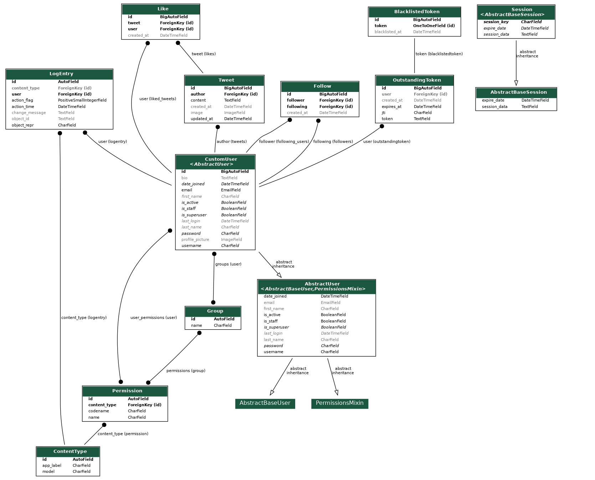

<div align="center" style="padding-top: 20px;">

# TweetLite Project

## This project implements a web application built with Django to simulate the functionality of a simple Mini Twitter platform.

</div>

## Table of Contents

- [Features](#features)
- [Technologies Used](#technologies-used)
- [How to Run the Project (backend with Django)](#how-to-run-the-project)
- [Project Structure](#project-structure)
- [Running with SQLite](#for-sqlite)
- [Running with Postgres](#for-postgres)
- [Postman](#postman)
- [Notes](#notes)
- [Dependencies](#dependencies)
- [Backend Repository Structure](#backend-repository-structure)
- [ERD Diagram](#erd-diagram)
- [How to Run the Project (frontend with React)](#front-end-with-react)

## Features

- **User registration and profile editing**
- **User authentication management (Django DRF with Simple JWT)**
- **Management of access permissions on each endpoint available**
- **Creation and management of tweets**
- **Listing, editing, and deleting tweets**
- **Like functionalities for tweets**
- **Following system with loading user feed from others users followed**
- **Counts of likes for each tweet**
- **Counts of followers and following for each user**

## Technologies Used

- 
- 
- 
- 
- 
- 
- 
- 
- 
- 
- 
- 

## How to Run the Project

1. **Clone the Repository (Back-end and Front-end)**  
   HTTPS:

   ```bash
   git clone https://github.com/yourusername/TweetLite.git
   ```

   OR

   SSH:

   ```bash
   git clone git@github.com:yourusername/TweetLite.git
   ```

   ## After the repository had been cloned you will find this structure files:

   ## Project Structure

   ```text
    .
    ├── back
    │   ├── Django Project
    │  ...
    │
    └── front
       └── b2bit
           ├── React with Vite Project
          ...
   ```

2. **Navegate to backend folder (back) with the Django project**

3. **Create and activate a Virtual Environment**

   ```bash
   python3 -m venv .venv
   source env/bin/activate
   ```

4. **Install Dependencies**

   ```bash
   pip install -r requirements.txt
   ```

5. **Rename the .env.exemple to .env and fill the content as needed**

   #### Ps: If you want to use SQLite as DataBase, just igonore the DATABASE Configuration on .env file, otherwise insert the Postgres configuration on DATABASE part.

   ##### Estruture of .env.exemple file:

   ```text
   # GENERALS
   SECRET_KEY="Put yours Django SECRET_KEY here"
   DEBUG="True"

   # JWT
   ROTATE_REFRESH_TOKENS="True"
   BLACKLIST_AFTER_ROTATION="True"
   ACCESS_TOKEN_LIFETIME="15"
   REFRESH_TOKEN_LIFETIME="1"

   # DATABASE (local: postgres, production: postgres)
   DATABASE_NAME="postgres"
   DATABASE_USER="user"
   DATABASE_PASSWORD="user password"
   DATABASE_HOST="address"
   DATABASE_PORT="5432"
   ```

6. **Configure the JWT as needed on .env file.**

7. **Generate a new Django SECRET_KEY and copy it on .env file (step 5)**

   ```bash
   python3 -c "from django.core.management.utils import get_random_secret_key; print(get_random_secret_key())"
   ```

## For SQLite

8. **Configure the settings.py File**

#### In the settings.py file (tweetlite/settings.py), just remove the comments for this DATABASE Configuration:

```python
DATABASES = {
    "default": {
        "ENGINE": "django.db.backends.sqlite3",
        "NAME": BASE_DIR / "db.sqlite3",
        "TEST": {
            "NAME": BASE_DIR / "test_db.sqlite3",
            "MIRROR": None,
        },
    }
}
```

## For Postgres

8. **Configure the settings.py File**

#### In the settings.py file (tweetlite/settings.py), just remove the comments for this DATABASE Configuration:

```python
DATABASES = {
    "default": {
        "ENGINE": "django.db.backends.postgresql",
        "NAME": env("DATABASE_NAME"),
        "USER": env("DATABASE_USER"),
        "PASSWORD": env("DATABASE_PASSWORD"),
        "HOST": env("DATABASE_HOST"),
        "PORT": env("DATABASE_PORT"),
    }
}
```

Ps: On this steep you should already been configured the .env with the Postgres DB conection configuration.

9. **Create the Database Tables**

```bash
python3 manage.py makemigrations
python3 manage.py migrate
```

10. **Create a Superuser in Django**

```bash
python3 manage.py createsuperuser
```

#### Follow the prompts in the terminal to set up the superuser:

```bash
Username (leave blank to use 'admin'): admin
Email address: admin@example.com
Password: ********
Password (again): ********
```

11. **Not mandatory: Populate the DataBase with test data**

#### The passwords for all users created will be: password123

```bash
python3 manage.py populate_db --settings=tweetlite.settings
```

12. **Start the Server**

```bash
python3 manage.py runserver
```

13. **Access the Application**

### After starting the server, you can access the application via a web browser:

#### Web Interface: Open your web browser and navigate to http://127.0.0.1:8000/ to access the main interface of the application.

#### Admin Interface: To manage users and other data, access the Django admin panel by navigating to http://127.0.0.1:8000/admin/. Use the superuser credentials you created earlier to log in.

## Postman

### Testing the API

#### To explore and test the API endpoints, you can either import the Postman collection file or access the online documentation available dor this project.

- **Import Collection**: Download and import the `B2Bit - TweetLite.postman_collection.json` file in Postman to access the main endpoints.
- **Postman API Documentation**: [Access the interactive API documentation](https://documenter.getpostman.com/view/38074810/2sAY4sij8K) to view and test endpoints and the documentation directly in your browser.

## Notes

- This project is a simple example for educational purposes and also part of a test in a selection to a trainee position.
- It is important to implement additional security measures to protect user data in a real environment.
- Adapt the project according to your needs and requirements.

## Dependencies

- `asgiref==3.8.1`: ASGI framework for Django.
- `cachetools==5.5.0`: Google Code-in tool for caching.
- `Django==5.1.2`: Django web development framework.
- `django-cors-headers==4.5.0`: A Django app for handling CORS.
- `django-environ==0.11.2`: Django environment variables management.
- `django-rql==4.4.1`: Django integration with Resource Query Language.
- `djangorestframework==3.15.2`: Toolkit for building Web APIs in Django.
- `djangorestframework-simplejwt==5.3.1`: Simple JSON Web Token authentication for Django REST framework.
- `lark-parser==0.11.0`: Parsing library for Python.
- `lib-rql==2.0.2`: Library for Resource Query Language.
- `pillow==11.0.0`: Python Imaging Library (PIL) fork.
- `psycopg2-binary==2.9.10`: PostgreSQL database adapter for Python.
- `PyJWT==2.9.0`: JSON Web Token implementation in Python.
- `python-dateutil==2.9.0.post0`: Powerful extensions to the standard Python datetime module.
- `six==1.16.0`: Python 2 and 3 compatibility library.
- `sqlparse==0.5.1`: SQL formatting and parsing tool.
- `typing_extensions==4.12.2`: Extensions for the typing module.

## Backend Repository Structure

```plaintext
back/                           # Main folder containing the entire backend project
├── B2Bit - TweetLite.postman_collection.json # Postman collection for API testing
├── .env.exemple               # Example environment variable configuration file
├── PopulateDB                  # Directory for database population scripts
│   └── management              # Django management commands directory
│       └── commands            # Directory for custom management commands
│           └── populate_db.py  # Script for populating the database with initial data
├── README.md                   # Documentation file for the project setup and usage
├── follows/                    # App for managing follower relationships
│   ├── admin.py                # Admin configuration for managing follows
│   ├── apps.py                 # Application configuration
│   ├── filters.py              # Filters for follower-related data retrieval
│   ├── models.py               # Models representing follow relationships
│   ├── permissions.py          # Permissions for follow-related actions
│   ├── serializers.py          # Serializers for API representation of follows
│   ├── urls.py                 # URL routing for follower-related endpoints
│   └── views.py                # API views for follow/unfollow actions
├── likes/                      # App for managing likes on tweets
│   ├── admin.py                # Admin configuration for managing likes
│   ├── apps.py                 # Application configuration
│   ├── filters.py              # Filters for like-related data retrieval
│   ├── models.py               # Models representing likes on tweets
│   ├── permissions.py          # Permissions for like-related actions
│   ├── serializers.py          # Serializers for API representation of likes
│   ├── urls.py                 # URL routing for like-related endpoints
│   └── views.py                # API views for like/unlike actions
├── manage.py                   # Django management script
├── media                       # Directory for uploaded media files
│   ├── profile_pics            # Folder for user profile pictures
│   └── tweet_images            # Folder for images attached to tweets
├── requirements.txt            # Production dependencies for the Django project
├── tweetlite                   # Main Django project folder with primary configurations
│   ├── asgi.py                 # ASGI configuration for asynchronous support
│   ├── settings.py             # Main settings file (database, installed apps, etc.)
│   ├── urls.py                 # Main URL routing for the Django project
│   └── wsgi.py                 # WSGI configuration for deployment
├── tweets/                     # App for managing tweets
│   ├── admin.py                # Admin configuration for managing tweets
│   ├── apps.py                 # Application configuration
│   ├── filters.py              # Filters for tweet-related data retrieval
│   ├── models.py               # Models representing tweets
│   ├── permissions.py          # Permissions for tweet-related actions
│   ├── serializers.py          # Serializers for API representation of tweets
│   ├── signals.py              # Signals for event-driven tweet functionality
│   ├── urls.py                 # URL routing for tweet-related endpoints
│   └── views.py                # API views for tweet actions (e.g., creating, viewing)
└── users/                      # App for managing user accounts and profiles
    ├── admin.py                # Admin configuration for managing users
    ├── apps.py                 # Application configuration
    ├── filters.py              # Filters for user-related data retrieval
    ├── models.py               # Models representing users
    ├── permissions.py          # Permissions for user-related actions
    ├── serializers.py          # Serializers for API representation of users
    ├── signals.py              # Signals for event-driven user functionality
    ├── urls.py                 # URL routing for user-related endpoints
    └── views.py                # API views for user actions (e.g., registration, profile updates)

```

## ERD Diagram

<p align="center">
    <a href="back/tweetlite_ERD_diagram.png" target="_blank">
        
    </a>
</p>

<br><br><br>

<hr>

# Front-end with React

## After cloning the repository, follow these steps to set up and run the React project with Vite:

1. **Navigate to the Frontend Folder**

   Open your terminal and change the directory to the frontend project folder:

   ```bash
   cd front/b2bit
   ```

2. **Install Dependencies**

   Make sure you have Node.js and npm installed. Then, install the necessary dependencies for the React project using the following command:

   ```bash
   npm install
   ```

3. **Start the Development Server**

   With the Django project running and after installing the dependencies, you can start the development server with the following command:

   ```bash
   npm install
   ```

4. **Open in Your Browser**

   Once the development server is running, open your browser and navigate to http://localhost:5173. You should see your React application running.

5. **Modify and Test**

   You can now make changes to the React components in the src folder. The application will automatically reload in your browser as you make changes.

6. **Building for Production**

   When you are ready to build your project for production, run:

   ```bash
   npm run build
   ```

   This will create a dist folder containing the optimized production build of your application.

### Notes:

- Test Project: This React project is a test application that consumes the API from the Django project. Ensure that there is data available in the database and that the Django server is running.
- Node.js and npm: Make sure you have the latest versions of Node.js and npm installed on your machine to avoid compatibility issues.
- Error Handling: If you encounter any errors during installation or while running the development server, check the console for error messages, as they often provide guidance on troubleshooting the issues.
